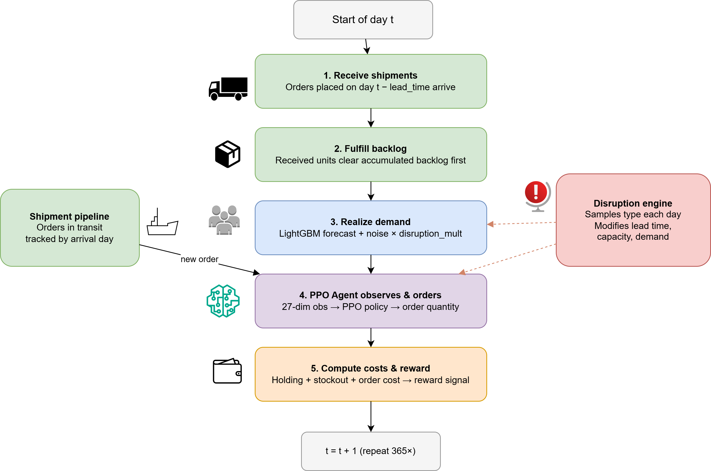
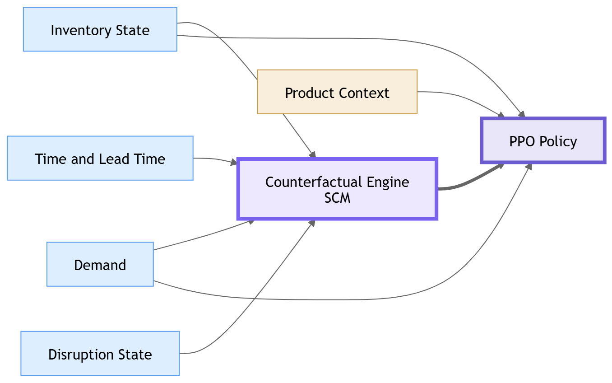
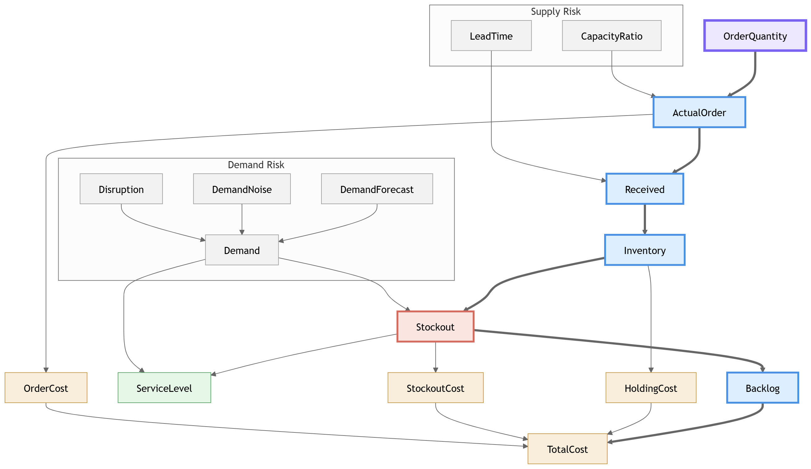
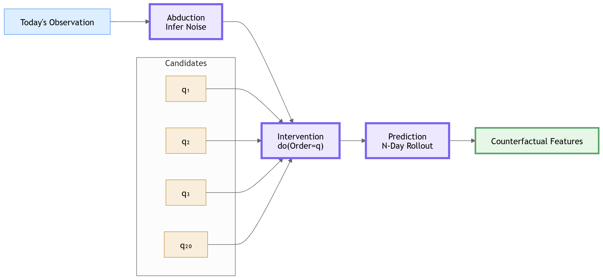

# Supply Chain Inventory Optimization with Reinforcement Learning

A PPO agent learns inventory replenishment policies for retail supply chains under uncertain demand, delayed deliveries, and random disruptions.

Unlike traditional inventory control approaches that react only to current observations, the agent is augmented with a **Structural Causal Model (SCM)** that performs counterfactual reasoning. At every decision step, the SCM simulates alternative ordering actions and summarizes their future consequences into compact features that are added to the policy observation.

The result is a universal inventory policy that generalizes across multiple item-store combinations while remaining robust to supply chain disruptions.

---

## System Overview



The framework combines four major components:

1. **Demand Forecasting** using LightGBM trained on the M5 dataset.
2. **Supply Chain Simulator** modeling inventory dynamics, lead times, backlog accumulation, and disruptions.
3. **Structural Causal Model (SCM)** for counterfactual lookahead.
4. **PPO Policy Network** that learns replenishment decisions from both current state and future projections.

---

## Interactive Supply Chain Simulation

https://github.com/user-attachments/assets/0b53e6ab-1cd9-4592-b6d7-d9eb6e9ae22a

The visualization demonstrates a trained PPO policy managing inventory under stochastic demand, delayed replenishment, and supply chain disruptions.

Displayed metrics include:

* Inventory on hand
* Backlog
* Pipeline inventory
* Daily demand
* Service level
* Ordering decisions
* Cumulative cost
* Active disruptions

The simulation can be paused, accelerated, reset, or subjected to manually triggered disruptions for interactive exploration.

---

## Problem

Each day, the agent decides how many units to order.

Inventory management requires balancing two competing objectives:

* Ordering too little leads to stockouts, backlog accumulation, and reduced service levels.
* Ordering too much increases holding costs and excess inventory.

The challenge is amplified by:

* Stochastic customer demand
* Variable lead times
* Capacity constraints
* Random disruptions such as port closures, supplier failures, and demand surges

The objective is to maximize service level while minimizing total inventory-related cost.

### MDP Formulation

**State**

27-dimensional observation vector containing:

* Inventory state
* Demand information
* Time and lead-time context
* Disruption state
* Counterfactual lookahead features
* Product-specific context

**Action**

Order quantity discretized into 20 candidate levels and scaled per item.

**Reward**

Base on service_level, total_cost, overstock_penalty and disruption_bonus.

---

## Observation Architecture



The observation vector is organized into six semantic groups:

| Group                    | Dimensions |
| ------------------------ | ---------- |
| Inventory State          | 0–3        |
| Demand                   | 4–5        |
| Time & Lead Time         | 6–10       |
| Disruption State         | 11–15      |
| Counterfactual Lookahead | 16–23      |
| Product Context          | 24–26      |

Among these groups, the SCM-generated counterfactual features provide model-based foresight by estimating future inventory, stockout, service-level, and cost outcomes under alternative ordering decisions.

---

## Supply Chain Causal Model



The SCM captures how ordering decisions propagate through inventory dynamics and ultimately affect business outcomes.

A change in order quantity influences:

```text
OrderQuantity
    ↓
ActualOrder
    ↓
Received
    ↓
Inventory
    ↓
Stockout
    ↓
Backlog
    ↓
Total Cost
```

while disruption variables influence lead times, supplier capacity, and demand conditions.

This causal structure enables counterfactual reasoning over future supply chain trajectories.

---

## Counterfactual Reasoning



At every environment step, the SCM evaluates multiple alternative order quantities over a 7-day horizon.

The process follows the standard causal inference pipeline:

### 1. Abduction

Infer latent noise variables from today's observation.

```text
noise_lead_time = observed_lead_time - expected_lead_time

noise_demand = observed_demand - forecast_demand
```

### 2. Intervention

Apply:

```text
do(OrderQuantity = q)
```

for each candidate action while keeping inferred noise fixed.

### 3. Prediction

Roll the SCM forward and aggregate outcomes.

Generated features include:

* Minimum stockout rate
* Maximum service level
* Minimum expected cost
* Cost sensitivity
* Risky-order fraction
* Best order ratio

The counterfactual engine evaluates:

```text
20 candidate actions × 7 days
= 140 simulated future transitions
```

per environment step.

These features provide the policy with model-based foresight without explicit planning or tree search.

---

## Key Variables

| Variable           | Description                    |
| ------------------ | ------------------------------ |
| inventory          | Units currently on hand        |
| backlog            | Accumulated unmet demand       |
| pipeline_qty       | Ordered units not yet received |
| inventory_position | inventory + pipeline − backlog |
| lead_time          | Days until order arrival       |
| service_level      | Fraction of demand fulfilled   |
| holding_cost       | Inventory carrying cost        |
| stockout_penalty   | Penalty for unmet demand       |

Disruption-specific variables:

* dis_type
* capacity_ratio
* demand_mult
* dis_days_remaining

---

## Disruption Model

Disruptions occur with an average inter-arrival time of approximately 60 days, resulting in roughly 5–7 events per episode.

| Type             | Lead Time Delta | Capacity | Demand Multiplier | Duration  |
| ---------------- | --------------- | -------- | ----------------- | --------- |
| Port Closure     | +10 to +20 days | 100%     | 1.0×              | 5–15 days |
| Supplier Failure | +0 to +5 days   | 20–50%   | 1.0×              | 7–21 days |
| Demand Surge     | 0 days          | 100%     | 1.5–3.0×          | 3–10 days |

---

## Results

The learned PPO policy is able to:

* Maintain higher service levels during disruptions
* Reduce stockout frequency
* Control inventory growth
* Balance ordering and holding costs
* Generalize across multiple item-store combinations

The SCM-enhanced policy consistently outperforms purely reactive inventory strategies because it can anticipate downstream inventory and service-level consequences before committing to an action.

---

## Project Structure

```
.
├── configs/config.yaml             # All tunable parameters
├── data/raw/
│   ├── sales_train_evaluation.csv
│   └── calendar.csv
├── models/
│   ├── best_model.zip
│   ├── ppo_universal_final.zip
│   ├── vecnormalize.pkl
│   └── demand_lgbm.pkl
├── env/supply_chain_env.py         # Gymnasium environment
├── simulator/
│   ├── supply_chain_engine.py      # Core simulation logic
│   ├── disruption_engine.py        # Stochastic disruption model
│   └── shipment_pipeline.py        # In-transit order tracking
├── demand/
│   ├── demand_generator.py         # Online inference wrapper
│   ├── feature_engineering.py      # Lag and rolling features
│   └── lightgbm_trainer.py         # LightGBM training
├── rl/
│   ├── train.py                    # PPO training entry point
│   └── evaluate.py                 # Policy comparison
├── causal/
│   ├── dag.py                      # Causal graph definition
│   ├── scm.py                      # Structural causal model
│   └── counterfactual_engine.py    # Counterfactual rollout
├── viz/
│   └── run_viz.py                  # Pygame visualization
└── notebooks/
    ├── 01_eda_m5.ipynb
    ├── 02_simulator_test.ipynb
    ├── 03_disruption_analysis.ipynb
    ├── 04_observation_space.ipynb
    └── 05_policy_evaluation.ipynb
```

---

## Setup

## Installation

```bash
python -m venv venv
source venv/bin/activate

pip install stable-baselines3[extra] lightgbm pandas numpy gymnasium pygame pyyaml matplotlib jupyter
```

Python 3.10 or 3.11 recommended.

M5 data can be downloaded from Kaggle:

https://www.kaggle.com/competitions/m5-forecasting-accuracy

Place the following files in:

```text
data/raw/sales_train_evaluation.csv
data/raw/calendar.csv
```

Train the demand forecasting model:

```bash
python -c "from demand.lightgbm_trainer import train_lgbm; train_lgbm()"
```

---

## Usage

Train from scratch:

```bash
python rl/train.py
```

Resume training:

```bash
python rl/train.py models/checkpoints/ppo_universal_250000_steps.zip
```

Evaluate policies:

```bash
python rl/evaluate.py
```

Run visualization:

```bash
python live_inference.py
```

TensorBoard:

```bash
tensorboard --logdir logs/tensorboard
```

### Visualization Controls

| Key   | Action             |
| ----- | ------------------ |
| Space | Play / Pause       |
| R     | Reset              |
| D     | Trigger disruption |
| ↑ ↓   | Simulation speed   |
| ← →   | Next item          |
